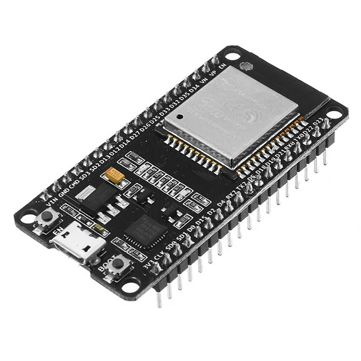

# ADAU1701-TCPi-ESP32

WiFi bridge between **SigmaStudio** and the **ADAU1701 DSP** using a ~$3 ESP32.  
Replaces ICP1 / ICP3 / ICP5 USB dongles. No pops or clicks thanks to hardware safeload.


<!-- Take a photo of your setup and save it as docs/hardware.jpg -->

---

## Flash the firmware

### Option A — Web browser (Chrome or Edge)
👉 **[Open web installer](https://rarranzb.github.io/ADAU1701-TCPi-ESP32)**  
No software needed. Just plug in the ESP32 and click Install.

### Option B — One command (Linux / macOS)
```bash
curl -fsSL https://raw.githubusercontent.com/rarranzb/ADAU1701-TCPi-ESP32/main/install.sh | bash
```

### Option C — Manual with esptool
```bash
pip install esptool
esptool.py --chip esp32 --baud 460800 write_flash 0x0 firmware/ADAU1701_TCPi_ESP32.bin
```

---

## First-time setup

1. The ESP32 creates a WiFi hotspot: **`ADAU1701-ESP32`** · password: `adau1701`
2. Connect to it and open **`http://192.168.4.1`**
3. Enter your WiFi credentials → Save → ESP32 reboots
4. In SigmaStudio: `USBi → TCP/IP → <ESP32 IP> : 8086`

All settings (WiFi, GPIO pins) are configured from the web interface — no code changes needed.

---

## Wiring

```
ADAU1701 / JAB4 (J4)     ESP32
────────────────────      ──────────
SCL  ─────────────────→   GPIO 17
SDA  ─────────────────→   GPIO 16
RESET ────────────────→   GPIO 21
SELFBOOT ─────────────→   GPIO 19
3.3V ─────────────────→   3.3V
GND  ─────────────────→   GND
```

Pins are configurable from `http://ESP32-IP/config`.

---

## Features

- ✅ Full SigmaStudio TCPi protocol over WiFi
- ✅ Hardware safeload — no pops or clicks when changing parameters
- ✅ Write to EEPROM directly from SigmaStudio (`Actions → Write Latest Compilation to E2Prom`)
- ✅ Web interface for WiFi and GPIO configuration
- ✅ AP mode for first-time setup from any phone or PC

---

## ICP vs ESP32

| | ICP1/ICP3/ICP5 | This project |
|-|---------------|-------------|
| Connection | USB | WiFi |
| Cost | $30–40 | ~$3 |
| No pops on parameter change | ✗ | ✅ |
| Web configuration | ✗ | ✅ |
| Open source | ✗ | ✅ |

---

## Build from source

If you want to modify the code:

1. Open `ADAU1701_TCPi_ESP32.ino` in Arduino IDE
2. `Tools → Board → ESP32 Dev Module`
3. `Sketch → Export Compiled Binary`
4. Merge into a single file:

```bash
mkdir firmware
esptool.py --chip esp32 merge_bin \
  --output firmware/ADAU1701_TCPi_ESP32.bin \
  0x1000  build/*/ADAU1701_TCPi_ESP32.ino.bootloader.bin \
  0x8000  build/*/ADAU1701_TCPi_ESP32.ino.partitions.bin \
  0x10000 build/*/ADAU1701_TCPi_ESP32.ino.bin
```

5. Commit and push `firmware/ADAU1701_TCPi_ESP32.bin`

---

## License

MIT — see [LICENSE](LICENSE)


